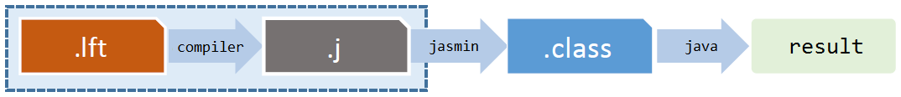

# Translator
A simple Java translator for code written in an arbitrary 'P' language with a defined grammar.

## Table of Contents
- [Project description](#project-description)
  - [Lexical scanner](#lexical-scanner)
  - [Parser top down](#parser-top-down)
  - [Valutator](#valutator)
  - [Translator](#translator)
- [Tools and languages](#tools-and-languages)
- [Contributing](#contributing)

## Project description
The aim of the project is to develop a simple Java translator for code written in an arbitrary 'P' language.

Components needed to build a translator:

#### **Lexical scanner** 
The aim of this component is to read a text sequence and produce the associated list of token, where a token correspond to a lexical unit like a number, an ID, a relational operator, keyword etc.
Token of the language are shown in the following table:

|        Token        |                 Pattern                |        Name        |
|:-------------------:|:--------------------------------------:|:------------------:|
|       Numbers       |    Numeric constant                    |         256        |
|     Identifier      | Letter followed by letters and numbers |         257        |
|       Relop         |  Relational operator (<,>,<=,>=,==,<>) |         258        |
|     Assignment      |                 assign                 |         259        |
|         To          |                   to                   |         260        |
|         If          |                   if                   |         261        |
|        Else         |                  else                  |         262        |
|       While         |                 while                  |         263        |
|       Begin         |                 begin                  |         264        |
|        End          |                  end                   |         265        |
|       Print         |                 print                  |         266        |
|        Read         |                  read                  |         267        |
|     Disjunction     |                   //                   |         268        |
|     Conjunction     |                   &&                   |         269        |
|      Negation       |                   !                    |          33        |
|  Parentheses left   |                   (                    |          40        |
|  Parentheses right  |                   )                    |          41        |
|      Brace left     |                   {                    |         123        |
|      Brace right    |                   }                    |         125        |
|       Addition      |                   +                    |          43        |
|     Subtraction     |                   -                    |          45        |
|    Multiplication   |                   *                    |          42        |
|       Division      |                   /                    |          47        |
|      Semicolon      |                   ;                    |          59        |
|        Colon        |                   ,                    |          44        |
|         EOF         |              end of input              |          -1        |

Identifiers correspond to the following regular expression:

(a + ... + z + A + ... + Z)(a + ... + z + A + ... + Z + 0 + ... + 9)*

while numbers correspond to the following regular expression:

0 + (1 + ... + 9)(0 + ... + 9)*

The lexical scanner must ignore all  white space characters, single and multiple line comments, but should report illegal characters like # or @.
The output of the lexical scanner must be in the form of <token0> <token1> <token2> ... <tokenN>. 

For example, for input "assign 300 to d" the lexical scanner output is: 

<259,assign> <256,300> <260,to> <257,d> <59> <-1>

The lexical scanner is not able to recognize the structure of commands, like 5+;) or (34+26( - (2+15-( 27. These will be recognized by lexical scanner.

#### **Parser top down**
This component is based on the following productions set:

Legend
- P   stands for  < prog >
- S   stands for  < statlist >
- S'  stands for  < statlistp >
- S"  stands for  < stat >
- S"' stands for  < statp >
- I   stands for  < idlist >
- I'  stands for  < idlistp >
- B   stands for  < bexpr >
- E   stands for  < expr >
- E'  stands for  < exprlist >
- E"  stands for  < exprlistp >

Productions
- P   -->  S EOF
- S   -->  S" S'
- S'  -->  ; S" S' | ε
- S"  -->  assign E to I
- S"  -->  print ( E' )
- S"  -->  read ( I )
- S"  -->  while ( B ) S"
- S"  -->  if ( B ) S" S"'
- S"  -->  { S }
- S"' -->  end | else S" end
- I   -->  ID I'
- I'  -->  , ID I' | ε
- B   -->  RELOP E E
- E   -->  + ( E' ) | - E E
- E   -->  * ( E' ) | / E E
- E   -->  NUM | ID
- E'  -->  E E"
- E"  -->  , E E" | ε
 
#### **Valutator**
This component is based on the SDT built based on the given grammar.

#### **Translator**
This component translate programs written in a simple programming language (called P language).
Programs written in the P language have the .lft extension.

The translator must generate bytecode that can be executed directly by the JVM.
Generating bytecode that can be directly executed by the JVM is not a simple operation, due to the complexity of the .class file (binary format). 
For this reason the bytecode will be generated through the use of a mnemonic language (https://en.wikipedia.org/wiki/List_of_Java_bytecode_instructions) that refers to the JVM assembly instructions and, subsequently, it can be translated into the .class format by the assembler program. 

The assembler program does a 1:1 translation of the mnemonic instructions into the corresponding JVM instructions (opcode). 
The assembler program used in this project is called Jasmin (http://jasmin.sourceforge.net/).
The translation scheme is the following:

The source code is translated by the compiler into the JVM assembler language (.j extension); after that it is translated into the .class file by Jasmin assembler program.
The compiling process generates an Output.j file and the following command is used to convert it in the Output.class file:

<strong>java -jar jasmin.jar Output.j</strong>

that can be executed with the following command:

<strong>java Output</strong>

## Tools and languages
- Java 11
- IntelliJ Idea Ultimate
- Jasmin
- Gradle
- GitHub Actions

## Contributing

